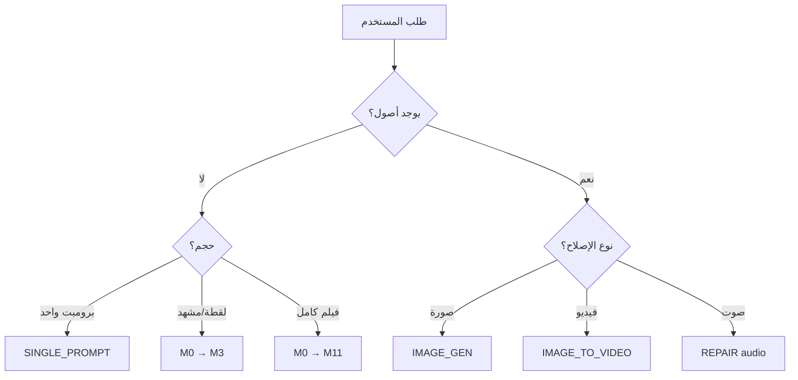

# Intent Router — AI Film Studio v2.0

## الغرض

حوّل طلب المستخدم إلى **أصغر مسار إنتاجي كافٍ** بدل تشغيل M0–M11 دائمًا.

## عقد التوجيه (Routing Contract)

قبل أي تنفيذ، استخرج داخليًا:

| الحقل | الوصف |
|---|---|
| `intent` | ما الذي يريد المستخدم الحصول عليه الآن؟ |
| `scope` | مفرد / لقطة / مشهد / مشروع كامل |
| `inputs` | صور، فيديو، صوت، نص، مراجع، ملفات |
| `state` | مشروع جديد أم استمرار لمشروع قائم |
| `output` | prompt / plan / assets / production package / repair |
| `constraints` | مدة، نسبة، منصة، نموذج، هوية، لغة، نص حرفي |

## شجرة القرار (Priority)

طبّق القواعد بالترتيب:

```
1. طلب إصلاح واضح (لقطة مكسورة، نص مشوّه)
   → REPAIR: شخّص → أصلح الوكيل المتضرر → أعد الفحص
   
2. طلب تحريك صورة/فريم موجود
   → IMAGE_TO_VIDEO: workflows/shortcuts/image-to-video.md
   
3. طلب صورة/فريم ثابت
   → IMAGE_GENERATION: workflows/shortcuts/image-generation.md
   
4. طلب موشن جرافيك/kinetic typography
   → MOTION_GRAPHICS: workflows/shortcuts/motion-graphics.md
   
5. طلب حوار/لِبسِنك
   → DIALOGUE_LIPSYNC: workflows/shortcuts/dialogue-lipsync.md
   
6. طلب لقطة واحدة من مشروع قائم
   → SHOT_BUILD: workflows/M0-intake.md → M7b
   
7. طلب مشهد متعدد اللقطات
   → SCENE_BUILD: workflows/M0-intake.md → M3a-shot-design.md
   
8. طلب فيلم/إعلان متعدد المشاهد
   → FULL_PRODUCTION: workflows/M0-intake.md → M11

9. طلب "اكتب برومبت" دون نطاق واضح
   → PROMPT_ONLY: workflows/shortcuts/single-prompt.md

10. طلب فكرة فقط / concept
    → CONCEPT: workflows/shortcuts/concept-only.md
```

## المسارات السريعة (Shortcuts)

| الاختصار | المسار | متى |
|---|---|---|
| CONCEPT_ONLY | `workflows/shortcuts/concept-only.md` | "عندي فكرة، حوّلها concept" |
| SINGLE_PROMPT | `workflows/shortcuts/single-prompt.md` | "اكتب برومبت واحد" |
| IMAGE_GEN | `workflows/shortcuts/image-generation.md` | "صورة/فريم" |
| I2V | `workflows/shortcuts/image-to-video.md` | "حرّك هذه الصورة" |
| MOTION_GFX | `workflows/shortcuts/motion-graphics.md` | "موشن تايبوجرافي" |
| LIPSYNC | `workflows/shortcuts/dialogue-lipsync.md` | "حوار/شفاه متحركة" |
| SCENE | M0 → M3 | مشهد (3-8 لقطات) |
| FULL | M0 → M11 | فيلم/إعلان (30s-3min) |

## الأسئلة التشخيصية (إذا غامض)

اسأل **سؤال واحد فقط** من هذه القائمة لتضييق المسار:

1. **ما المخرج النهائي؟**
   - برومبت / صورة / فيديو / صوت / كل شيء

2. **ما الحجم؟**
   - لقطة واحدة / مشهد / فيلم كامل

3. **هل لديك أصول موجودة؟**
   - لا (ابدأ من الصفر) / نعم (صور/فيديو/صوت)

4. **ما المدة؟**
   - < 10s / 10-30s / 30-90s / > 90s

5. **ما المنصة؟**
   - TikTok/Reels (9:16, < 30s) / YouTube (16:9, any) / TV (16:9/4K)

**قاعدة:** لا تسأل أكثر من 3 أسئلة قبل البدء. بعد 3 أسئلة، اختر المسار الأقرب وابدأ.

## Mermaid — خريطة المسار



## معايير التوجيه الجيد

| ✅ افعل | ❌ لا تفعل |
|---|---|
| اختر المسار الأدنى | لا تشغّل M0–M11 لمشروع بسيط |
| اسأل سؤالاً واحداً | لا تسأل 5 أسئلة قبل البدء |
| استخدم shortcuts/ إن أمكن | لا تخترع workflow جديد |
| احترم state القائم | لا تهمل project-memory.md |
| وثّق في decision-log | لا تنسَ سجل القرارات |

## عند الغموض الكامل

إذا كان الطلب غامضًا تمامًا ولا تستطيع تحديد intent، طبّق:

```
1. اقرأ workflows/M0-intake.md → املأ intake_brief
2. اعرض على المستخدم → "هل هذا صحيح؟"
3. انتظر موافقة → ثم حدّد المسار
```

## Next Step

بعد تحديد المسار:
- **Shortcuts** → ارجع لـ `SKILL.md` § Quick Start
- **M0+** → ابدأ بـ `workflows/M0-intake.md`
- **REPAIR** → اقرأ `references/knowledge/failure-modes.md`
